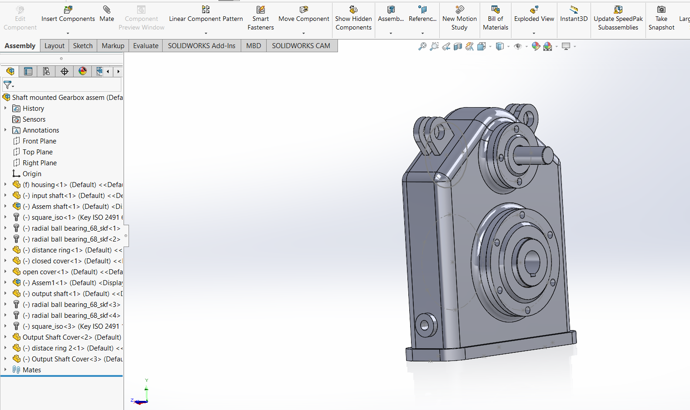
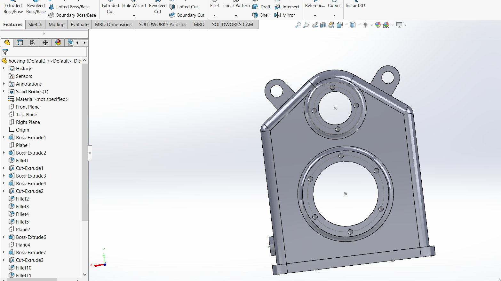
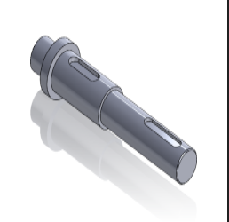

# Shaft-Mounted Gearbox Design

A 3D mechanical CAD project featuring the design and assembly of a shaft-mounted gearbox developed using **SOLIDWORKS**.

The project includes the gearbox housing, input and output shafts, covers, distance rings, bearings, and associated mechanical components assembled into a complete gearbox system.

---

## Project Overview

This project focuses on the 3D modeling and assembly of a mechanical gearbox system using SOLIDWORKS.

Individual components were modeled as separate parts and combined into the final assembly to demonstrate mechanical CAD modeling, component integration, and assembly design.

---

## Main Components

- Gearbox housing
- Input shaft
- Output shaft
- Shaft covers
- Open and closed covers
- Distance rings
- Bearings
- Keys and supporting mechanical components
- Final gearbox assembly

---

## CAD Model & Assembly

### Complete Gearbox Assembly



The final assembly integrates the gearbox housing, input and output shafts, covers, bearings, distance rings, and supporting mechanical components into a complete shaft-mounted gearbox system.

### Gearbox Housing



The gearbox housing was modeled as a dedicated SOLIDWORKS part featuring shaft openings, mounting features, bearing locations, and the main structural geometry of the gearbox.

### Shaft Design



The shaft was modeled as an individual mechanical component with stepped diameters and keyway features before being integrated into the final gearbox assembly.

---

## CAD Workflow

The project was developed through a component-based mechanical design workflow:

1. Individual gearbox components were modeled as separate SOLIDWORKS parts.
2. Shafts, covers, distance rings, and housing features were created according to the required geometry.
3. Standard mechanical components such as bearings and keys were incorporated into the design.
4. The individual parts were combined using assembly mates.
5. Component positions and mechanical relationships were checked in the final assembly.
6. The complete shaft-mounted gearbox was reviewed as an integrated mechanical system.

---

## Project Structure

```text
shaft-mounted-gearbox-solidworks/
│
├── assets/
│   ├── gearbox_complete_assembly.png
│   ├── gearbox_housing.png
│   └── gearbox_shaft.png
│
├── solidworks-files/
│   ├── SOLIDWORKS part files (.SLDPRT)
│   └── SOLIDWORKS assembly files (.SLDASM)
│
└── README.md
```

---

## SOLIDWORKS Files

The repository includes the original editable SOLIDWORKS project files.

The `solidworks-files/` directory contains the individual part models and assembly files used to build the gearbox.

File types include:

- `.SLDPRT` — SOLIDWORKS Part files
- `.SLDASM` — SOLIDWORKS Assembly files

These files can be opened in SOLIDWORKS for further inspection, modification, or assembly review.

---

## Skills Demonstrated

- 3D CAD modeling
- Mechanical component design
- SOLIDWORKS part modeling
- Assembly modeling
- Mechanical component integration
- Shaft and housing design
- Assembly mates
- Mechanical design workflow

---

## Tools

- **SOLIDWORKS**
- 3D Part Modeling
- Assembly Design
- Mechanical CAD

---

## Project Scope

This project demonstrates practical experience in creating a multi-component mechanical CAD system rather than a single isolated part.

The project covers the workflow from individual component modeling to integration of the parts into a complete shaft-mounted gearbox assembly.
